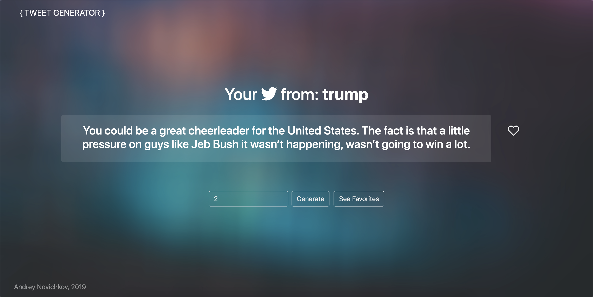

<div style="padding-top: 40px" align="center">
    <table style="border: none">
        <tr>
            <td>
                <h2>Welcome to TweeterIO!</h2>
            </td>
            <td>
                </a>
            </td>
        </tr>
    </table>
    
</div>


<p align="center">
Generate funny Tweets from personalities like Trump or Putin, or in the tone of books such as War and Peace! Under the hood, this Tweet Generator is based on the n'th order Markov Chain principle. Large bodies of text are analyzed turned into a 3rd order Markov Chain, which is then used to randomly generate tweets. 
</p>

<h3 style="text-center"><a href="http://tweeterio.herokuapp.com/welcome">Official Website</h3>

<div align="center">
    
</div>

<br>

## Table of Contents
- [Installation](#installation)
  - [Manual](#manual)
  - [License](#license)
  - [Examples](#examples)
  - [Contributors](#contributors)

<a name="installation"></a>

## 🚀 Installation

### Manual

```bash
# Clone repo
git clone https://github.com/APNovichkov/TweeterIO.git
# CD into repo folder and setup python virtual environment
cd TweeterIO 
python -m venv
# Install python requirements
pip install -r requiremenets.txt
# Run in Terminal :)
python app.py
#or
flask run
```

## Examples


## 📝 License

By contributing, you agree that your contributions will be licensed under its MIT License.

In short, when you submit code changes, your submissions are understood to be under the same [MIT License](http://choosealicense.com/licenses/mit/) that covers the project. Feel free to contact the maintainers if that's a concern.

<a name="contributors"></a>

## Contributors

Contributions are welcome!

<table>
  <tr>
    <td align="center"><a href="https://github.com/APNovichkov"><br /><sub><b>Andrey Novichkov</b></sub></a><br /><a href="https://github.com/APNovichkov/ParticleIO/commits/master" title="Code">💻</a></td>
  </tr>
 </table>
